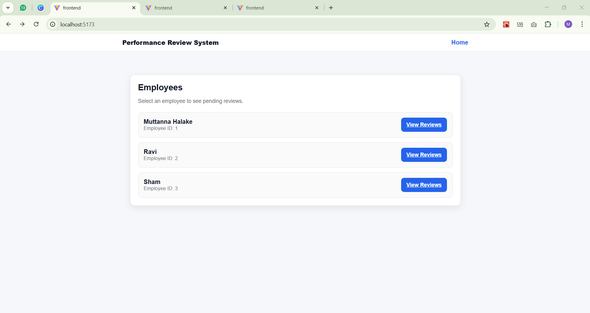
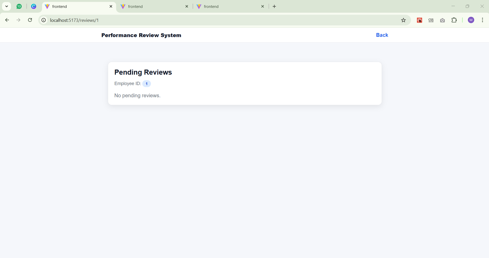
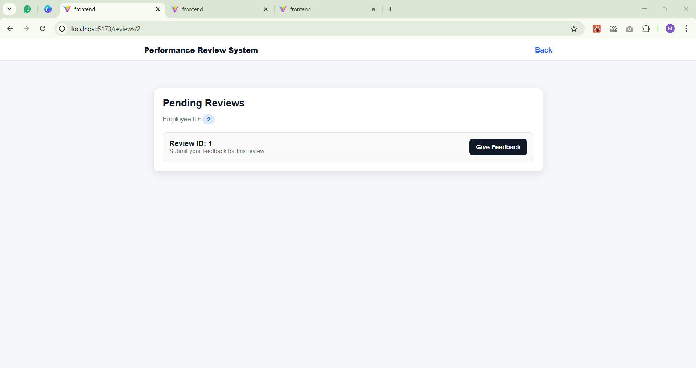
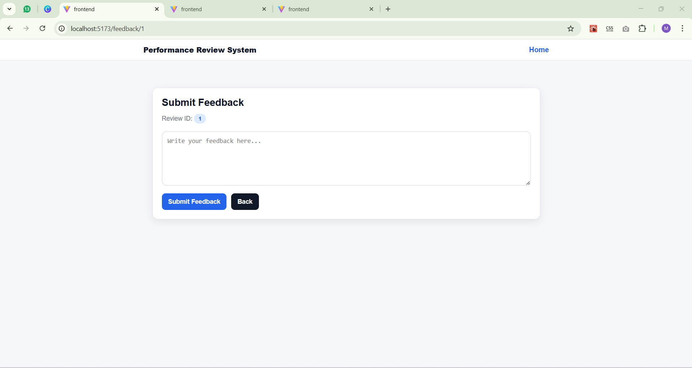
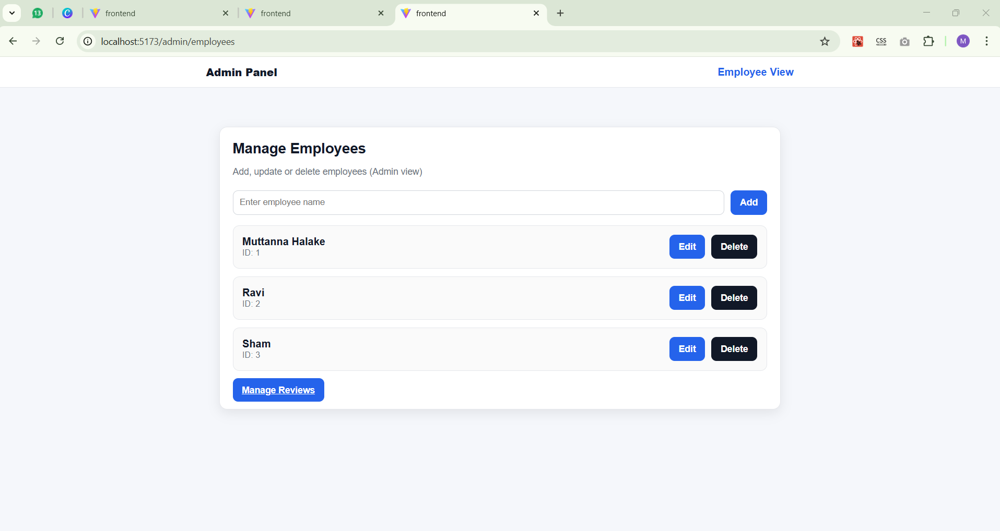
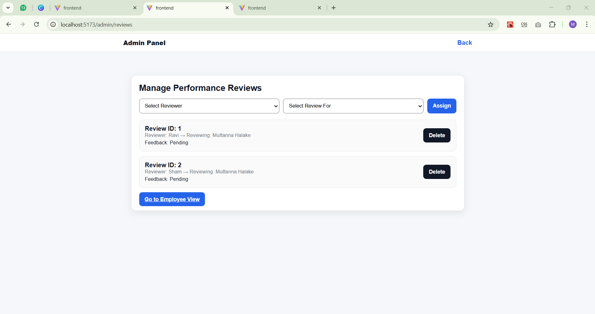

# Performance Review System (Interview Assignment)

This is a simple web application that allows employees to submit feedback for other employees' performance reviews.

##Technology
- **Frontend:** React (Vite) + Axios
- **Backend:** Java + Spring Boot
- **API:** REST APIs
- **Storage:** In-memory (ArrayList)

## Features Implemented

### Admin View
- Add / Update / Delete / View Employees
- Create / Assign Performance Reviews
- View All Performance Reviews

###Employee View
- View pending performance reviews assigned to them
- Submit feedback for assigned reviews

### Project Screenshot












## How to Run the Project

### 1) Run Backend
Open terminal inside backend folder:

```bash
cd backend
mvn spring-boot:run
```
### 2) Run Frontend
```bash
cd frontend
npm install
npm run dev
```
### Manage Employees
http://localhost:5173/admin/employees
http://localhost:5173/admin/reviews

### Employee View
http://localhost:5173/
http://localhost:5173/reviews/:employeeId
http://localhost:5173/feedback/:reviewId


